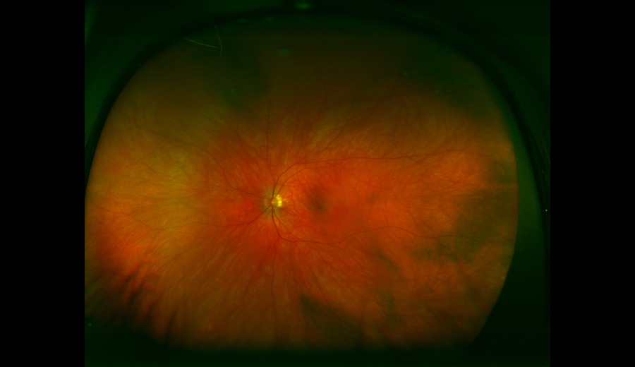
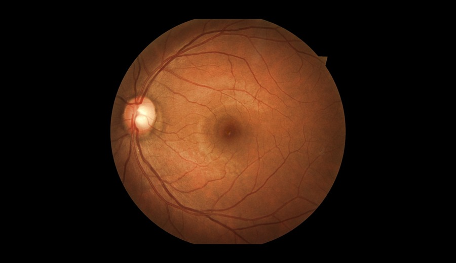
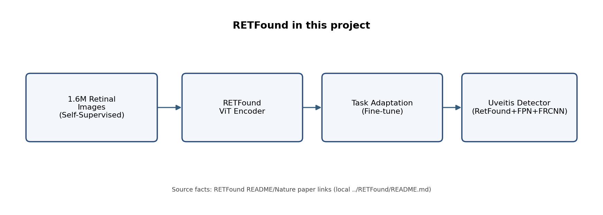
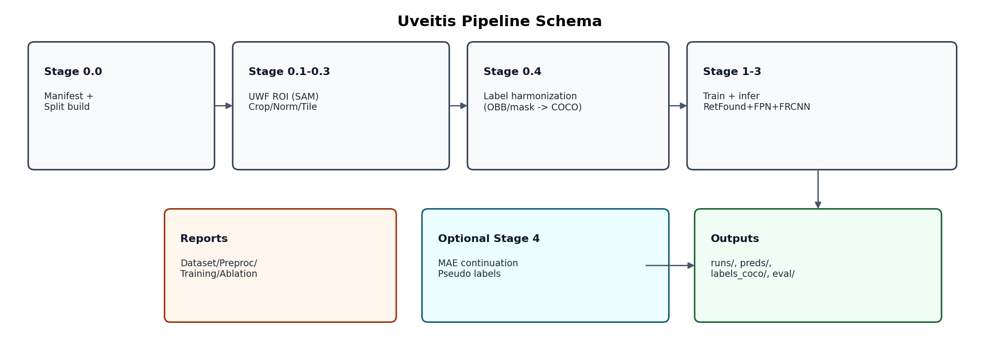

# Uveitis Codex Documentation

This documentation covers the pipeline scaffold implemented in this repository:
- folder and artifact contracts
- stage/program entrypoints
- YAML configuration schema
- module + function-level API reference

## Project Goal

Build a practical model pipeline that localizes and classifies uveitis-related symptoms on UWF fundus images, with clinically useful recall and interpretable outputs, not benchmark-chasing perfection.

## Context: Pros and Cons

### Pros

- Uveitis symptoms overlap with diabetic-retinopathy lesion patterns, enabling transfer from larger DR datasets.
- Available compute is strong (remote 40GB A100), so detector training and tiling workflows are feasible.
- RetFound provides a retina-pretrained ViT backbone that is useful for transfer.
- There is a labeled UWF uveitis subset (OBB symptom annotations) to target final adaptation.

### Cons

- UWF images are inconsistent and contain non-fundus artifacts (eyelids, lashes, machine parts).
- Most public DR datasets are regular fundus and often grading-focused rather than localization-focused.
- RetFound pretraining domain is regular fundus, not pure UWF.
- Target uveitis labeled set is very small (~100 images) with lax boxes (converted from circled annotations).

## Implementation Philosophy

- Trustworthiness before complexity: deterministic, verifiable outputs at each stage.
- Strong preprocessing first: fundus ROI masking/cropping and retina-only normalization before training.
- Start with robust geometry: HBB detector workflow even when source labels are OBB.
- Use mature detection stack: two-stage detector with RetFound backbone adaptation.
- Transfer curriculum over brute force: FGADR supervised lesion pretraining -> UWF fine-tuning.
- Keep optional steps optional: MAE continuation and pseudo-label expansion only after a stable baseline.
- Evaluate for clinical utility: relaxed IoU and sensitivity at fixed FP/image, not mAP alone.

## Why this design

- It maximizes reliability under small, noisy labels.
- It minimizes research-code risk by using standard components.
- It gives fast, inspectable intermediate artifacts for debugging and collaboration.

## Visual Intuition

### UWF vs Regular Fundus

| UWF example | Regular fundus example |
|---|---|
|  |  |

Source images:
- UWF: `datasets/uwf-700/Images/Uveitis/Uveitis-001.jpg`
- Regular fundus: `datasets/eyepacs/train/13_left.jpg`

### RETFound Illustration



Illustration intent:
- summarizes how RETFound pretraining knowledge is reused in this project’s detector stack.
- based on RETFound repository information (`../RETFound/README.md`).

### Pipeline Schema



Start here:
1. [Folder Reference](structure/folder-reference.md)
2. [Stage Map](structure/stage-map.md)
3. [Docker Runbook](structure/docker-runbook.md)
4. [Script Catalog](scripts/index.md)
5. [Config Catalog](configs/index.md)
6. [API Reference](api/index.md)

How to use this as a newcomer:
1. Read [Stage Map](structure/stage-map.md) for the full flow.
2. Run one stage script from [Script Catalog](scripts/index.md).
3. Open the matching YAML in [Config Catalog](configs/index.md).
4. If you need implementation detail, jump to [API Reference](api/index.md).

Optional rendered docs site (MkDocs):
```bash
pip install -r requirements-docs.txt
mkdocs serve
```
Then open `http://127.0.0.1:8000`.
