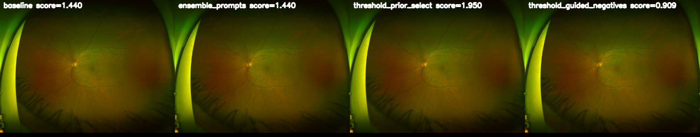

# `compare_sam2_masking.py`

## Purpose
Compare multiple SAM2 fundus masking strategies on a small UWF-700 sample and write side-by-side visual strips.

Goal: include the full fundus while excluding machinery/surroundings as often as possible.

Example comparison strip:


## CLI
```bash
python scripts/compare_sam2_masking.py \
  --config configs/stage0_preprocess.yaml \
  --n 20 \
  --out eval/sam2_mask_compare_uwf20 \
  --save-max-side 1024 \
  --overwrite
```

## Methods
Current set (see `eval/.../summary.json` for aggregate proxies):
- `baseline`: prompted SAM2 mask with morphology + hole fill
- `ensemble_prompts`: multiple prompt templates, pool candidates, select best
- `threshold_prior_select`: select the candidate that best covers a threshold fundus prior while penalizing border leakage
- `threshold_guided_negatives`: threshold-derived positives plus extra negatives sampled near borders

## Writes
- `eval/sam2_mask_compare_uwf20/comparisons/*.png` (4-column strip per image)
- `eval/sam2_mask_compare_uwf20/<method>/{overlays,masks,masked}/*.png`
- `eval/sam2_mask_compare_uwf20/summary.json` (aggregate proxies)
- `eval/sam2_mask_compare_uwf20/selected_images.json` (sample list)

## Notes
- No ground truth segmentation is assumed; comparisons are by visual inspection plus heuristics.
- Saved images are downscaled for speed via `--save-max-side` (masks use nearest-neighbor).

