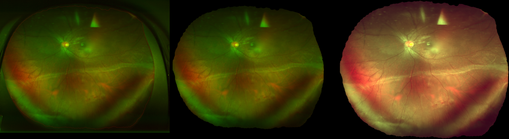

# `stage0_preprocess.py`

## Purpose
Run Stage 0 preprocessing (ROI mask, crop, normalization, global resize, tiles) and write verification artifacts.
For UWF images, ROI can use prompted SAM2 (`roi.method_by_dataset.uwf700: sam2_prompted`) before cropping and photometric normalization.

High-level intent:
- mask the fundus/retina region (ROI) and black out everything else (eyelids, lashes, machine frame)
- compute color/contrast statistics using ROI pixels only (excluding pure black)
- apply normalization only inside the ROI (outside stays black, like regular fundus borders)

Example (overlay, masked raw, normalized):


## CLI
```bash
python scripts/stage0_preprocess.py --config configs/stage0_preprocess.yaml [--manifest PATH] [--max-images N]
```

## Pipeline Details

Order of operations (per image):
1. **ROI mask**: `compute_roi_mask(...)`
   - `uwf700` uses `sam2_prompted` by default (config-driven).
   - postprocessing includes morphology + "fill holes by taking everything inside the largest outline" (so optic disc holes do not remain holes).
2. **Crop**: crop to the ROI bounding box (with `roi.crop_pad_px` padding).
3. **Stats mask**: erode ROI mask by `normalize.stats_erode_px` to reduce border contamination.
   - **black pixels are excluded** from stats to avoid bias from fundus borders and masked-out regions.
4. **Normalization**: normalize ROI pixels using stats mask; non-ROI pixels are forced to black.
   - see `normalize.method` in config
5. **Global resize**: pad-to-square then resize to `resize.global_size`.
6. **Tiling**: generate overlapping tiles (`tiling.tile_size`, `tiling.overlap`).

### Config Example

Minimal relevant excerpt from `configs/stage0_preprocess.yaml`:

```yaml
roi:
  method_by_dataset:
    uwf700: sam2_prompted
  downsample_max_side: 768
  crop_pad_px: 12
  sam2:
    checkpoint: models/sam2/sam2.1_hiera_base_plus.pt
    model_cfg: configs/sam2.1/sam2.1_hiera_b+.yaml
    device: cuda
    fallback_to_threshold: true
    points_norm:
      - [0.50, 0.50, 1]
      - [0.03, 0.03, 0]
      - [0.97, 0.97, 0]

normalize:
  method: reinhard_lab_ref
  stats_erode_px: 4
  ref:
    stats_path: preproc/ref/regular_fundus_color_stats.json
```

## Reads
- Input manifests listed in config (or `--manifest` override).
- `roi.sam2` (or `roi.sam`) checkpoint and prompts when SAM mode is enabled.
- When using `normalize.method: reinhard_lab_ref`, a reference stats JSON is required (see below).

## Writes
- `preproc/roi_masks`, `preproc/crops`, `preproc/crop_meta`
- `preproc/norm`, `preproc/norm_meta`
- `preproc/global_1024`, `preproc/tiles`, `preproc/tiles_meta`
- `preproc/verify/*`

## Normalization Modes

Configured via `normalize.method`:
- `zscore_rgb`: per-image z-score in RGB using ROI stats; clipped to preserve most dynamic range.
- `grayworld`: simple channel gain balancing from ROI stats.
- `clahe_luminance`: CLAHE on LAB luminance, restricted to ROI region to avoid background bias.
- `reinhard_lab_ref`: Reinhard-style mean/std matching in LAB from ROI stats to a *regular fundus* reference.

### `reinhard_lab_ref` Reference Stats

To normalize UWF colors toward regular fundus, first compute a reference from regular fundus datasets (mask-first, non-black pixels only):

```bash
python scripts/build_regular_fundus_color_ref.py \
  --config configs/stage0_preprocess.yaml \
  --per-dataset 50 \
  --out preproc/ref/regular_fundus_color_stats.json
```

Then set in `configs/stage0_preprocess.yaml`:
- `normalize.method: reinhard_lab_ref`
- `normalize.ref.stats_path: preproc/ref/regular_fundus_color_stats.json`

## Functions
| Function | Description |
|---|---|
| `_overlay_boundary(image, mask_rgb)` | Draws ROI boundary edges over the raw image for montage QA. |
| `_preview(image, max_side)` | Downscales an image for compact montage visualization. |
| `main()` | Loads manifests/config, runs preprocessing, writes verification montages and reconstruction metrics. |

## Core module dependencies
- [`uveitis_pipeline.preprocess`](../api/preprocess.md)
- [`uveitis_pipeline.common`](../api/common.md)
